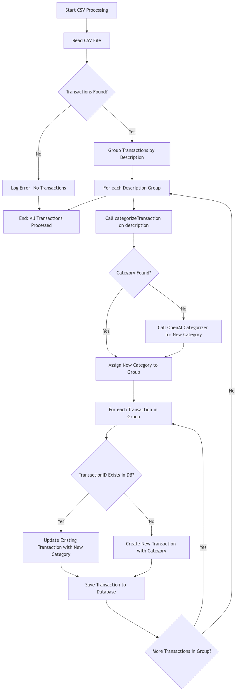
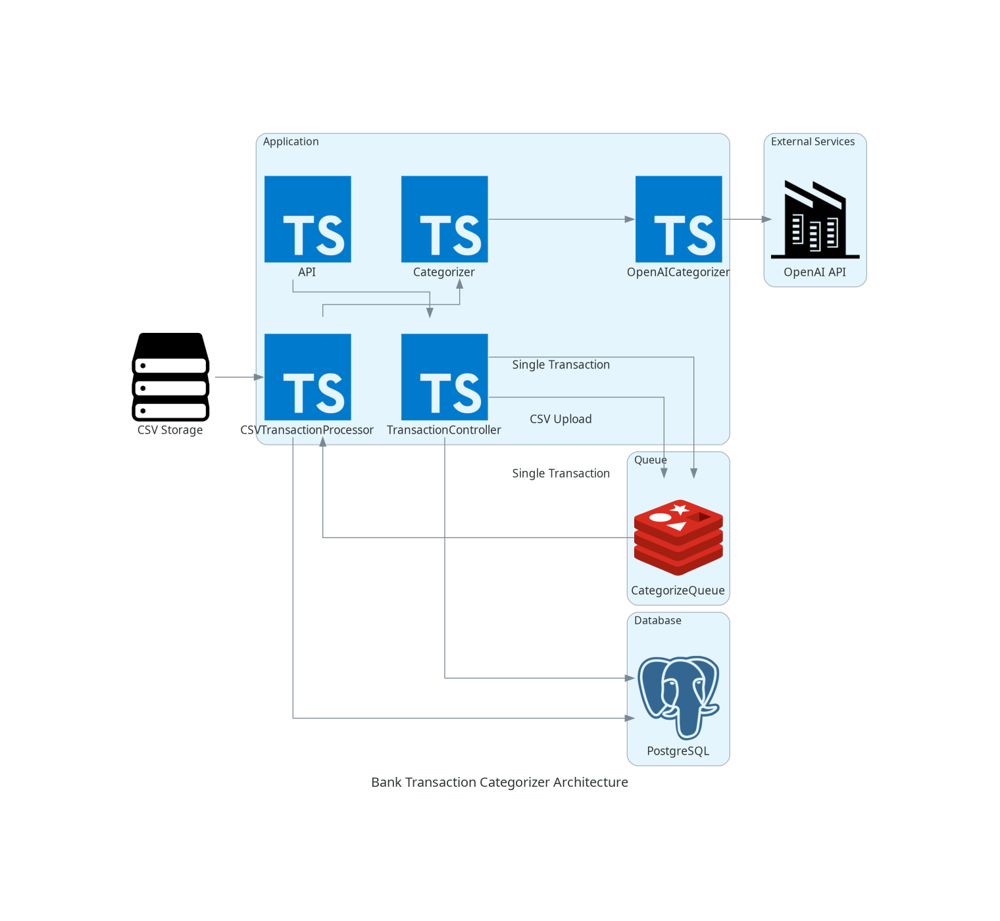
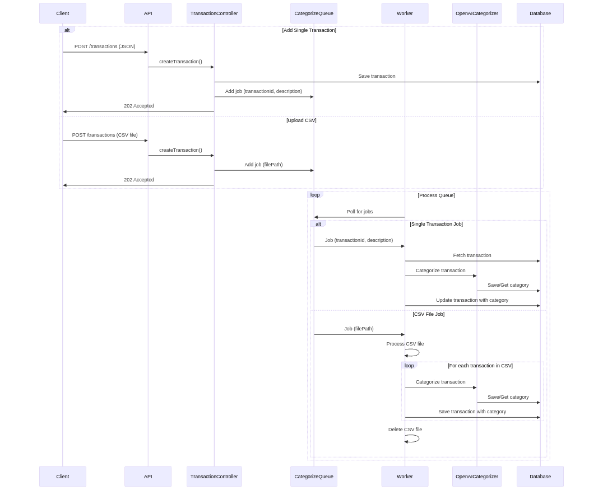

# Setup and Running Instructions

To set up and run the application, simply execute:

```bash
docker-compose up -d
```

## Running Tests

To create a test database, run the following commands:

```bash
yarn run db:test:create
yarn run migrate:test
```

To execute the tests, use:

```bash
yarn run docker:test
```

## Seeding the Database

To populate the database with predefined transactions, run:

```bash
yarn run transactions:process
```

## Configuration

Don’t forget to update the `OPENAI_API_KEY` in the `.env.development` file with your own API key.

## API Documentation

Access the Swagger documentation here: [http://localhost:3000/api-docs](http://localhost:3000/api-docs)

## OpenAI Structured Outputs

OpenAI has recently introduced structured outputs in their API, which can be found here: https://openai.com/index/introducing-structured-outputs-in-the-api/. This feature is utilized in this project.

## CSV File Processing and Transaction Categorization

This application supports both uploading a CSV file to the `/transactions` endpoint and submitting individual transactions. Regardless of the method, transactions are queued using Bull queue with Redis and processed in the background.

1. **CSV Parsing**: 
   - The application reads the CSV file with `fs.createReadStream()` and parses it using `csv-parser`, transforming each row into a transaction object with relevant properties.

2. **Transaction Grouping**: 
   - Transactions are grouped by their `description` for efficient processing.

3. **Categorization**: 
   - The `categorizeTransaction` function assigns an appropriate category based on the transaction description.

4. **Saving Transactions**: 
   - Each transaction is updated with its assigned category and saved to the database.

This approach ensures effective processing and categorization of transactions before storage.

### Flow Chart:



## Trade-offs

- **Focus on Description**: The categorization process prioritizes the Transaction description for simplicity.
- **Reusing Categories**: Transactions with identical descriptions are categorized similarly to minimize OpenAI API calls.
- **Model Selection**: The GPT-4o-mini model is employed to balance cost and inference quality.

## Architecture Diagram



## Sequence Diagram



## Potential Improvements

- Implement pagination for the `GET /transactions` endpoint.
- Enhance bulk processing for OpenAI categorization.
